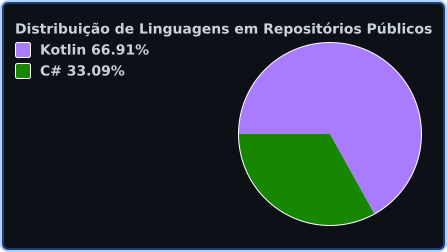

# Olá, eu sou o Ruan 👋

### 👨‍💻 Software Development Intern | Backend | Kotlin • Java • Spring Boot • SQL

Sou estudante de **Análise e Desenvolvimento de Sistemas** e atualmente atuo como **Estagiário de Desenvolvimento de Software na Kaffa Tech**.

Meu foco é **desenvolvimento backend**, principalmente com **Kotlin, Java, Spring Boot, APIs REST, SQL e PostgreSQL**.

Também possuo experiência anterior com suporte técnico, infraestrutura e processos relacionados a ativos de TI, o que contribuiu para desenvolver uma visão prática de tecnologia, resolução de problemas e ambientes corporativos.

Atualmente venho aprofundando meus conhecimentos em **arquitetura de APIs, segurança, bancos de dados, testes e boas práticas de desenvolvimento de software**.

---

## 🚀 Tecnologias e conhecimentos

### Backend

### Banco de dados

### Ferramentas

---

---

## 📊 Linguagens mais utilizadas

  

> As estatísticas são baseadas no código presente nos meus repositórios públicos e não representam nível de proficiência.

---

## 📌 Projetos em destaque

### 🔐 Auth API Kotlin

API REST de autenticação desenvolvida com **Kotlin, Spring Boot, Spring Security e PostgreSQL**.

Principais recursos implementados:

- Cadastro de usuários
- Login com e-mail e senha
- BCrypt para proteção de senhas
- Autenticação com JWT
- Spring Security
- Endpoints protegidos
- Tratamento de exceções
- Verificação de e-mail duplicado
- Variáveis de ambiente para informações sensíveis

➡️ [Ver projeto](https://github.com/ruancsv/auth-api-kotlin)

---

### 📦 Controle de Estoque

Sistema desenvolvido em **C#** com operações CRUD, criado para praticar lógica de programação e conceitos de gerenciamento de dados.

➡️ [Ver projeto](https://github.com/ruancsv/CONTROLE_ESTOQUE_RCS)

---

### 🧮 Calculadora Básica

Aplicação desenvolvida em **C#** para prática dos fundamentos da linguagem e lógica de programação.

➡️ [Ver projeto](https://github.com/ruancsv/calculadora_basica_rcs)

---

## 📚 Atualmente aprofundando conhecimentos em

- Kotlin
- Spring Boot
- APIs REST
- Spring Security e JWT
- SQL e PostgreSQL
- Testes automatizados
- Docker
- Boas práticas de desenvolvimento backend

---

## 🎯 Objetivo profissional

Continuar evoluindo como **desenvolvedor backend**, construindo uma base sólida em:

- Kotlin e Java
- Spring Boot
- APIs REST
- Orientação a Objetos
- SQL e bancos de dados relacionais
- Segurança de aplicações
- Testes automatizados
- Git e GitHub
- Docker e deploy de aplicações

Busco aplicar esses conhecimentos em projetos cada vez mais próximos de cenários reais de desenvolvimento de software.

---

## 🎓 Formação

**Análise e Desenvolvimento de Sistemas**  
Universidade Anhembi Morumbi

---

## 💼 Experiência atual

**Estagiário de Desenvolvimento de Software — Kaffa Tech**

Atualmente desenvolvendo minha experiência profissional na área de software e aprofundando conhecimentos em tecnologias e práticas utilizadas no desenvolvimento de sistemas.

---

## 📫 Contato

